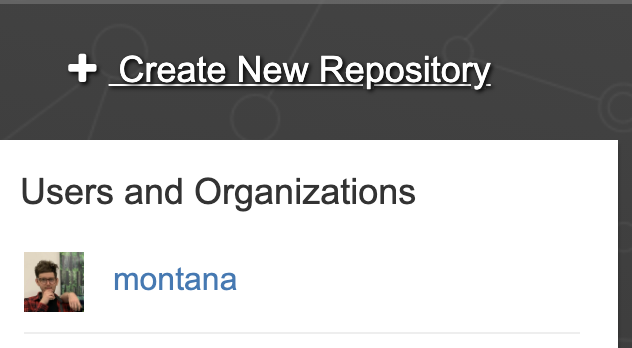
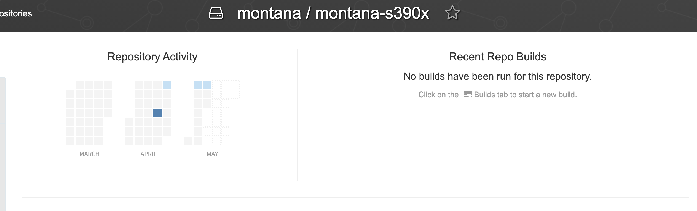
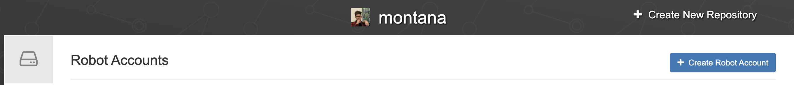

<!-- more --> 

In some cases, I prefer using Quay.io as my container registry instead of Dockerhub. If this is the case for you and want to learn how to, keep reading! 

## Using Travis CI with Quay.io

I've setup a tutorial repository, so fork the tutorial repository, https://github.com/Montana/travis-quay-tutorial. Next, you’ll need to edit the `.travis.yml` and `docker_push` files in your repo, replacing [yourusername] with the username of your quay account.

## Creating your Quay repository 

When signed into Quay, in the upper right-hand corner, you’ll see a `+ Create New Repository` button. Click the button.

 

Make sure you select Public instead of Private this is a mistake I made when first starting out with Quay. I made a repo entitled `montana-s390x`.

## Creating your Quay robot account

Click the `+` button to create your robot account. Give the Robot admin privileges, you'll then see where you can expand on your account name, here will be the `secrets` you want to use as `env vars` in Travis.

## Finally

Now that you’ve set everything Quay up, you can commit your changes to `.travis.yml` and `docker_push`, then push your changes to your fork. This should trigger a build with Travis, which will build the container, and instead of pushing it to Dockerhub, it will push it to Quay.
